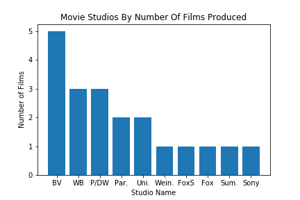
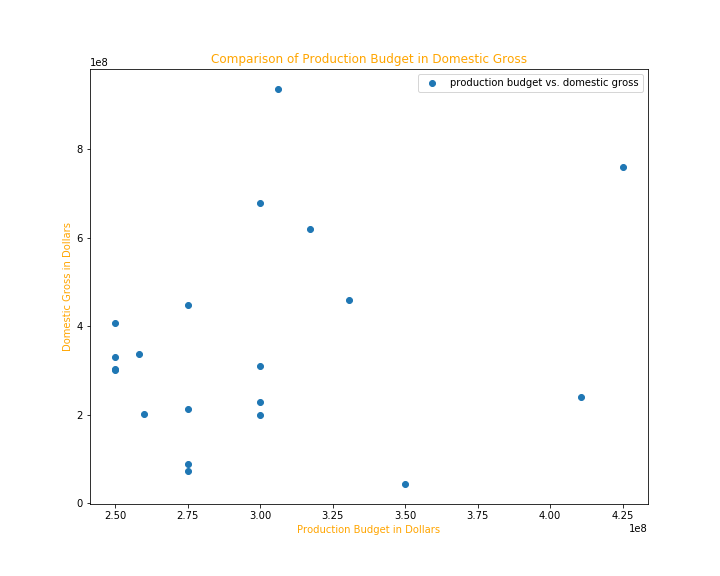

# Microsoft in the Movie Industry

Author: James Stipanowich

## Introduction/Overview

Microsoft wants to create movies, but their movie knowledge is limited and they want knowledge about the movie industry from me. This project explores three questions Microsoft might ask about movies and the movie industry from a specified given group of movie datasets. I will discuss three questions Microsoft may pose about movies and how these questions influence movie making. The researched analyses from the obtained data can provide conclusions on what movies to make and how to go about navigating the movie industry. Also, information on movies could help with future movie analyses and give direction on how to continue to improve the movie-making process.

### Business Problem

Microsoft sees all the big companies creating original video content and they want to get in on the fun. They have decided to create a new movie studio, but the problem is they don’t know anything about creating movies. They have hired me to help them better understand the movie industry. I am charged with exploring three questions about what types of film are currently doing the best at the box office. I must translate these findings into actionable insights that the head of Microsoft's new movie studio can use to help decide what types of film to create.

### The Data

In the folder `zippedData` are movie datasets from:

* Box Office Mojo
* IMDB
* Rotten Tomatoes
* TheMovieDB.org

I was given the choice of what data from these datasets to use and how to use it.

These datasets were provided to me by Flatiron School for the Microsoft project.

### Movie Analysis Methods and Results

Microsoft wants to create movies. 
 

Microsoft might want to know which movie studios are popular for producing movies. A good movie studio choice could help a film succeed. One question Microsoft might ask is:

What studios produce the most motion pictures?

I looked through a provided movie dataset from the Box Office Mojo website to answer this question for Microsoft. I performed two analyses to answer this question. The first analysis determined the number of movies created per studio for the first 20 rows in the provided Box Office Mojo dataset:

Buena Vista(BV), Warner Brothers(WB), and Paramount/DreamWorks(P/DW) studios produced the highest number of movies out of all the movies produced in the first twenty rows of the Box Office Mojo dataset.

The second analysis determined the number of movies created by the top 20 studios ordered by number of movies per studio in the whole Box Office Mojo dataset 

This second analysis shows that IFC Films(IFC), Universal Studios(Uni.), and Warner Brothers Studios(WB) produced the greatest number of films according to the Box Office Mojo dataset.

Microsoft might want to look at what specific movies in general are extremely popular. A movie as its own subset can provide a lot of information to a filmmaker. Microsoft might ask the question:

What movies got the most votes online?

Movie datasets provided for this project from The Internet Movie Database(IMDb) can answer this question.

After compiling the data from the IMDb datasets, "Inception," "The Dark Knight Rises," and "Interstellar" were the movies found to receive the most votes in the IMDb movie datasets.  These movies can be considered most popular in comparison to the whole dataset.

Another aspect of movie creation that Microsoft might want to look into is how a movie production budget and the amount of money the movie makes interrelate. Microsoft might ask:

How does production budget relate to domestic gross for movies?

The answer to this question can be determined using the "tn" dataset. 

The scatter plot diagram of the comparison between production budget and domestic gross for the "tn" dataset displays that movies have a fairly relative domestic gross in comparison to production budget. However, higher production budgets did not necessarily produce greater domestic gross. Some of the higher value relationships were closer to outlier data. Lower production budgets could have a slightly higher domestic gross in relation to a normal regression line.

Side note: My graphs included subsets of 20 values as the random number of values to generate a good dispersion of data. This is part of the data cleaning processes.  When too many or too few items are used in a dataset, the dataset may be much more difficult to interpret. My conclusions from the data are generated with cleaned data.

### Conclusions

Here are the findings in response to Microsoft's three questions:

- IFC Films, Universal Studios, Paramount Pictures, and Warner Brothers Studios created the most films in the Box Office Mojo dataset. They are popular studios to use or collaborate with for movie making.

- According to IMDb datasets, "Inception," "The Dark Knight Rises," "Interstellar," "Django Unchained," and "Avengers" are the movies that received the most number of votes at IMDb.  They are great movies to watch for movie-making purposes based on their popularity.

- The "tn" movie dataset that was provided displays a fairly regular relationship between movie budget and domestic gross.  However, there were some higher budget movies in the dataset that might be considered outliers and did not necessarily produce higher domestic gross, whereas some lower budget movies in the dataset seemed to have the possibility of a slightly higher domestic gross in relation to the normal regression line.  The comparison is fairly normal betweeen production budget and domestic gross, but there might be greater domestic gross for a movie with a lower production budget.

### Recommendations for Further Analysis

- My analysis could improve with more specific resource information on the 'tn.movie_budgets.csv.gv' . I could not easily decipher the website this dataset related to from the information provided for this project. I need more information provided on where this dataset came from beyond "tn.movie_budgets.csv.gv".

- A comparison could be made between production budget and worldwide gross for the "tn" movie dataset.  My analysis only covered the production budget and domestic gross relationship for movies within the "tn" movie dataset. 

- Some analyses on movies based on the year they were released might add more dimensions to my results. The history of a specific year can influence the movies that were released, how they were released, and why they were released.

- The relationship between movies and genre popularity could be looked at. Certain movie genres may be more popular to use when creating a feature film.

### For More Information

- See the full analysis of my findings in MovieDataAnalysis.ipynb

- Contact me at jmstipanowich@gmail.com

### Repository Structure

├── MovieDataImages
├── zippedData
├── MicrosoftMovieDataPowerpoint2.pdf
├── MovieDataAnalysis.ipynb
└── README.md
└── student.ipynb